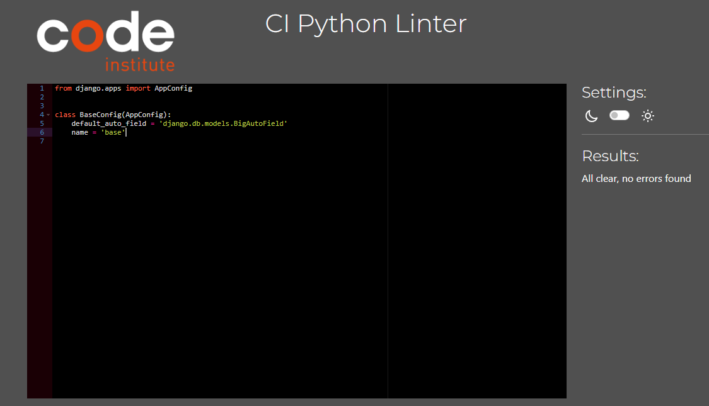

# TaskFlow

## Table of Contents

- [Overview](#overview)
- [User Stories](#user-stories)
- [Design](#design)
- [Features](#features)
- [Testing and Validation](#testing-and-validation)
- [Deployment](#deployment)
- [Bugs](#bugs)
- [Credits](#credits)
- [AI Contributions](#ai-contributions)
- [Future Improvements](#future-improvements)

## Overview

TaskFlow is a Django-based to-do list application designed to help users manage their daily tasks efficiently. Users can create, edit, delete, and mark tasks as completed, providing a simple and organized way to stay productive.

### User Stories

- As a user, I want to add tasks to my to-do list so that I can keep track of what I need to do.
- As a user, I want to mark tasks as completed so that I can see what I have accomplished.
- As a user, I want to delete tasks so that I can remove items I no longer need.
- As a user, I want to edit a task's details so that I can update its description or due date.
- As a user, I want to view all my tasks in one place so that I can easily manage them.

## Design

### Wireframes

Wireframes for TaskFlow were created to visualize the layout and user interface of the application. These wireframes include:

- Home Page: Displays a list of tasks with options to add, edit and delete.

- Login/Register Page: Allows users to log in or register for a new account.

### Colour Scheme

The colour scheme for TaskFlow is designed to be clean and minimalistic, focusing on usability and readability.

## Features
  
- **User Authentication:** Users can log in and log out to access their personal task lists.

  

  

- **Task Management:**
  - Add new tasks.

  

  

  - Edit existing tasks.

  

  

  - Delete tasks.

  

  

- **Responsive Design:** Works on both mobile and desktop devices.

## Testing and Validation

### Testing Results

### Validation

## Python Validation

All python files were validated using the Code Institute Python Linter

All files generating the "E501 line too long" error are automatically generated by Django. The custom files have already been fixed and pass validation without any issues.

## Deployment

## Bugs

## Credits

### Media

### Testing

## AI Contributions

## Future Improvements

- Task Prioritization: Allow users to set priority levels for tasks
- Due Dates and Reminders: Enable users to set due dates for tasks and receive reminders via email or notifications.
- Progress Tracking: Implement a progress tracking feature to show the completion status of tasks and subtasks.
- Dark Mode: Add a dark mode option for better usability in low-light environments.
- Search Functionality: Implement a search feature to allow users to quickly find tasks by keywords.
